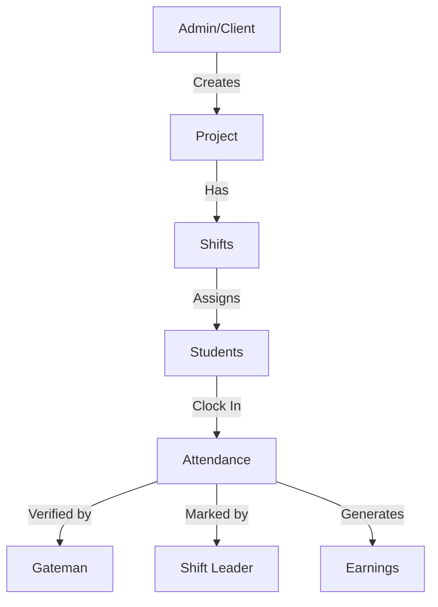

# Student Work Management System Documentation

## Table of Contents
1. [System Overview](#system-overview)
   - [Purpose](#purpose)
   - [Core Features](#core-features)
   - [System Flow](#system-flow)
2. [Database Collections](#database-collections)
   - [User Management](#user-management)
   - [Availability Management](#availability-management)
   - [Project Management](#project-management)
   - [Shift Management](#shift-management)
   - [Assignments and Requests](#assignments-and-requests)
   - [Attendance Management](#attendance-management)
   - [Feedback and Earnings](#feedback-and-earnings)

## System Overview

### Purpose
The Student Work Management System manages student workplace assignments, attendance tracking, and payment processing. It supports various user roles including admins, clients, students, shift leaders, and gatemen.

### Core Features
- Role-based access control
- Project and shift management
- QR-based attendance verification
- Automated payment calculations
- Performance tracking and feedback

### System Flow

## Database Collections

# USER MANAGEMENT
APPWRITE_ADMINS_COLLECTION_ID: ADMINS_COLLECTION_ID,
table: admins
- userId (string, 36) [Primary Key, Required]
- role (string[enum: 'admin']) [Required]
- firstName (string, 100) [Required]
- lastName (string, 100) [Required]
- email (string, 255) [Required, Unique]
- phone (string, 20) [nullable]
- createdAt (datetime) [Required]

APPWRITE_CLIENTS_COLLECTION_ID: CLIENTS_COLLECTION_ID,
table: clients
- userId (string, 36) [Primary Key, Required]
- role (string[enum: 'client']) [Required]
- firstName (string, 100) [Required]
- lastName (string, 100) [Required]
- email (string, 255) [Required, Unique]
- phone (string, 20) [nullable]
- createdAt (datetime) [Required]

APPWRITE_STUDENTS_COLLECTION_ID: STUDENTS_COLLECTION_ID,
table: students
- userId (string, 36) [Primary Key, Required]
- role (string[enum: 'student']) [Required]
- firstName (string, 100) [Required]
- lastName (string, 100) [Required]
- email (string, 255) [Required, Unique]
- phone (string, 20) [nullable]
- dateOfBirth (datetime, nullable)
- availabilityStatus (string[enum: 'active', 'inactive']) [Required]
- punctualityScore (double) [Required, Default: 100.0]
- rating (double) [Required, Default: 5.0]
- createdAt (datetime) [Required]

APPWRITE_SHIFT_LEADERS_COLLECTION_ID: SHIFT_LEADERS_COLLECTION_ID,
table: shiftLeaders
- userId (string, 36) [Primary Key, Required]
- role (string[enum: 'shiftLeader']) [Required]
- firstName (string, 100) [Required]
- lastName (string, 100) [Required]
- email (string, 255) [Required, Unique]
- phone (string, 20) [nullable]
- createdAt (datetime) [Required]

APPWRITE_GATEMEN_COLLECTION_ID: GATEMEN_COLLECTION_ID,
table: gatemen
- userId (string, 36) [Primary Key, Required]
- role (string[enum: 'gateman']) [Required]
- firstName (string, 100) [Required]
- lastName (string, 100) [Required]
- email (string, 255) [Required, Unique]
- phone (string, 20) [nullable]
- clientId (string, 36) [Foreign Key -> clients.userId, Required]
- createdAt (datetime) [Required]

# AVAILABILITY MANAGEMENT
APPWRITE_USER_AVAILABILITY_COLLECTION_ID: USER_AVAILABILITY_COLLECTION_ID,
table: userAvailability
- availabilityId (string, 36) [Primary Key, Required]
- userId (string, 36) [Required]
- userRole (string[enum: 'admin', 'client', 'student', 'shiftLeader', 'gateman']) [Required]
- dayOfWeek (string[enum: 'Monday', 'Tuesday', 'Wednesday', 'Thursday', 'Friday', 'Saturday', 'Sunday']) [Required]
- shiftType (string[enum: 'day', 'night']) [Required]
- status (string[enum: 'active', 'inactive']) [Required]
- createdAt (datetime) [Required]

# PROJECT MANAGEMENT
APPWRITE_PROJECTS_COLLECTION_ID: PROJECTS_COLLECTION_ID,
table: projects
- projectId (string, 36) [Primary Key, Required]
- name (string, 255) [Required]
- description (string, 1000) [nullable]
- status (string[enum: 'active', 'completed', 'suspended']) [Required]
- ownerId (string, 36) [Required]  // ID of admin or client who owns the project
- ownerRole (string[enum: 'admin', 'client']) [Required]
- createdAt (datetime) [Required]
- updatedAt (datetime) [Required]

APPWRITE_PROJECT_RATES_COLLECTION_ID: PROJECT_RATES_COLLECTION_ID,
table: projectRates
- rateId (string, 36) [Primary Key, Required]
- projectId (string, 36) [Foreign Key -> projects.projectId, Required]
- weekdayDayRate (double) [Required]
- weekdayNightRate (double) [Required]
- saturdayDayRate (double) [Required]
- saturdayNightRate (double) [Required]
- sundayDayRate (double) [Required]
- sundayNightRate (double) [Required]
- effectiveFrom (datetime) [Required]
- effectiveUntil (datetime, nullable)
- createdBy (string, 36) [Foreign Key -> admins.userId, Required]
- createdAt (datetime) [Required]
- updatedAt (datetime) [Required]

APPWRITE_PROJECT_MEMBERS_COLLECTION_ID: PROJECT_MEMBERS_COLLECTION_ID,
table: projectMembers
- memberId (string, 36) [Primary Key, Required]
- projectId (string, 36) [Foreign Key -> projects.projectId, Required]
- userId (string, 36) [Required]
- userRole (string[enum: 'admin', 'client', 'student', 'shiftLeader', 'gateman']) [Required]
- membershipType (string[enum: 'owner', 'student', 'shiftLeader', 'client', 'manager', 'member', 'observer']) [Required]
- addedBy (string, 36) [Required]
- addedByRole (string[enum: 'admin', 'client']) [Required]
- status (string[enum: 'active', 'inactive']) [Required]
- createdAt (datetime) [Required]
- updatedAt (datetime) [Required]

# SHIFT MANAGEMENT
APPWRITE_SHIFTS_COLLECTION_ID: SHIFTS_COLLECTION_ID,
table: shifts
- shiftId (string, 36) [Primary Key, Required]
- projectId (string, 36) [Foreign Key -> projects.projectId, Required]
- shiftLeaderId (string, 36) [Foreign Key -> shiftLeaders.userId, Required]
- gatemanId (string, 36) [Foreign Key -> gatemen.userId, Required]
- date (date) [Required]
- dayOfWeek (string[enum: 'Monday'...'Sunday']) [Required]
- timeType (string[enum: 'day', 'night']) [Required]
- startTime (datetime) [Required]
- stopTime (datetime) [Required]
- requiredStudents (integer) [Required]
- assignedCount (integer) [Required, Default: 0]
- shiftType (string[enum: 'normal', 'filler']) [Required]
- status (string[enum: 'draft', 'published', 'inProgress', 'completed', 'cancelled']) [Required]
- createdBy (string, 36) [Required]
- createdByRole (string[enum: 'admin', 'client']) [Required]
- createdAt (datetime) [Required]
- updatedAt (datetime) [Required]

# ASSIGNMENTS AND REQUESTS
APPWRITE_SHIFT_ASSIGNMENTS_COLLECTION_ID: SHIFT_ASSIGNMENTS_COLLECTION_ID,
table: shiftAssignments
- assignmentId (string, 36) [Primary Key, Required]
- shiftId (string, 36) [Foreign Key -> shifts.shiftId, Required]
- studentId (string, 36) [Foreign Key -> students.userId, Required]
- projectMemberId (string, 36) [Foreign Key -> projectMembers.memberId, Required]
- status (string[enum: 'pending', 'assigned', 'confirmed', 'completed', 'cancelled']) [Required]
- assignedBy (string, 36) [Required]
- assignedByRole (string[enum: 'admin', 'client']) [Required]
- assignedAt (datetime) [Required]
- confirmedAt (datetime, nullable)
- createdAt (datetime) [Required]
- updatedAt (datetime) [Required]

APPWRITE_ADMIN_REQUESTS_COLLECTION_ID: ADMIN_REQUESTS_COLLECTION_ID,
table: adminRequests
- requestId (string, 36) [Primary Key, Required]
- requestType (string[enum: 'shiftCancellation', 'fillerShiftApplication', 'availabilityChange']) [Required]
- requesterId (string, 36) [Required]
- requesterRole (string[enum: 'admin', 'client', 'student', 'shiftLeader', 'gateman']) [Required]
- shiftId (string, 36) [Foreign Key -> shifts.shiftId, nullable]
- assignmentId (string, 36) [Foreign Key -> shiftAssignments.assignmentId, nullable]
- reason (string) [nullable]
- status (string[enum: 'pending', 'approved', 'rejected']) [Required]
- reviewedBy (string, 36) [Foreign Key -> admins.userId, nullable]
- createdAt (datetime) [Required]

# ATTENDANCE MANAGEMENT
APPWRITE_ATTENDANCE_COLLECTION_ID: ATTENDANCE_COLLECTION_ID,
table: attendance
- attendanceId (string, 36) [Primary Key, Required]
- shiftId (string, 36) [Foreign Key -> shifts.shiftId, Required]
- studentId (string, 36) [Foreign Key -> students.userId, Required]
- qrCode (string, 255) [Required]
- scheduledStartTime (datetime) [Required]
- scheduledEndTime (datetime) [Required]
- clockInTime (datetime, nullable)
- clockOutTime (datetime, nullable)
- trackedHours (double, nullable)
- lostHours (double, nullable)
- verificationStatus (string[enum: 'pending', 'verified', 'rejected']) [Required]
- attendanceStatus (string[enum: 'pending', 'present', 'absent', 'late']) [Required]
- clockInVerifiedBy (string, 36) [Foreign Key -> gatemen.userId, nullable]
- markedByLeader (string, 36) [Foreign Key -> shiftLeaders.userId, nullable]
- createdAt (datetime) [Required]
- updatedAt (datetime) [Required]

# FEEDBACK AND EARNINGS
APPWRITE_FEEDBACK_COLLECTION_ID: FEEDBACK_COLLECTION_ID,
table: feedback
- feedbackId (string, 36) [Primary Key, Required]
- studentId (string, 36) [Foreign Key -> students.userId, Required]
- shiftId (string, 36) [Foreign Key -> shifts.shiftId, Required]
- projectId (string, 36) [Foreign Key -> projects.projectId, Required]
- punctualityRating (double) [Required]
- overallRating (double) [Required]
- comments (string) [nullable]
- submittedBy (string, 36) [Foreign Key -> shiftLeaders.userId, Required]
- createdAt (datetime) [Required]

APPWRITE_EARNINGS_COLLECTION_ID: EARNINGS_COLLECTION_ID,
table: earnings
- earningId (string, 36) [Primary Key, Required]
- studentId (string, 36) [Foreign Key -> students.userId, Required]
- shiftId (string, 36) [Foreign Key -> shifts.shiftId, Required]
- attendanceId (string, 36) [Foreign Key -> attendance.attendanceId, Required]
- appliedRate (double) [Required]
- rateType (string[enum: 'weekdayDay', 'weekdayNight', 'saturdayDay', 'saturdayNight', 'sundayDay', 'sundayNight']) [Required]
- trackedHours (double) [Required]
- lostHours (double) [Required]
- totalAmount (double) [Required]
- status (string[enum: 'calculated', 'verified', 'paid']) [Required]
- calculatedBy (string, 36) [Foreign Key -> admins.userId, Required]
- verifiedBy (string, 36) [Foreign Key -> admins.userId, nullable]
- createdAt (datetime) [Required]
- updatedAt (datetime) [Required]